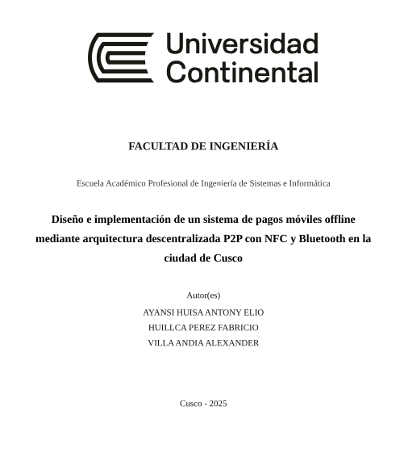

# Diseño e implementación de un sistema de pagos móviles offline mediante arquitectura descentralizada P2P con NFC y Bluetooth en la ciudad de Cusco

[<a href="./Diseño%20e%20implementación%20de%20un%20sistema%20de%20pagos%20móviles%20offline%20mediante%20arquitectura%20descentralizada%20P2P%20con%20NFC%20y%20Bluetooth%20en%20la%20ciudad%20de%20Cusco%20.docx" style="display:inline-block;padding:16px 32px;background:#1976d2;color:#fff;font-size:1.25em;font-weight:bold;text-decoration:none;border-radius:8px;margin-bottom:16px;text-align:center;">⬇️ Descargar documento de tesis</a>]

Repositorio académico que contiene el trabajo de tesis titulado **"Diseño e implementación de un sistema de pagos móviles offline mediante arquitectura descentralizada P2P con NFC y Bluetooth en la ciudad de Cusco"**, presentado en el año **2025** como requisito para optar el título profesional de **Ingeniería de Sistemas**.

---

## Resumen

En los últimos años, los pagos digitales se han convertido en un componente esencial del comercio moderno, facilitando transacciones rápidas y seguras. Sin embargo, la gran mayoría depende de una conexión continua a internet, lo cual excluye a comunidades con conectividad limitada.

Este proyecto propone el diseño e implementación de un sistema de pagos digitales **offline**, basado en tecnologías como **NFC** y **Bluetooth**, que permite transferencias entre dispositivos móviles sin conexión a internet en tiempo real. Introduce un modelo de validación distribuida con dispositivos cercanos llamados *testigos*, que participan automáticamente para verificar y respaldar transacciones. Cuando alguno de estos dispositivos recupera conectividad, retransmite la transacción al servidor central.

Esta arquitectura busca mejorar la descentralización, accesibilidad y resiliencia de los pagos digitales en contextos rurales o de emergencia.

---

## Autores

- **Ayansi Huisa Antony Elio**
- **Huillca Perez Fabricio**
- **Villa Andia Alexander**

---

## Cómo citar esta tesis

### Formato APA (7ma edicion)

>Ayansi Huisa, A. E., Huillca Perez, F., & Villa Andia, A. (2025). Diseño e implementación de un sistema de pagos móviles offline mediante arquitectura descentralizada P2P con NFC y Bluetooth en la ciudad de Cusco [Tesis de Ingeniería de Sistemas, Universidad Continental]. https://github.com/antonyayansi/taller-investigacion-ii.

### Formato ISO 690

>AYANSI HUISA, Antony Elio; HUILLCA PEREZ, Fabricio; VILLA ANDIA, Alexander. Diseño e implementación de un sistema de pagos móviles offline mediante arquitectura descentralizada P2P con NFC y Bluetooth en la ciudad de Cusco. Cusco, 2025. Tesis (Ingeniería de Sistemas) — Universidad Continental.

---

## Licencia

Este trabajo está licenciado bajo **Creative Commons Atribución-NoComercial-CompartirIgual 4.0 Internacional (CC BY-NC-SA 4.0)**.

---